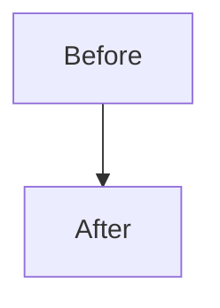

<!--
Be concise and human-first. Prefer short bullets and clear language.
Required: complete the five levels of explanation for every PR.
Optional sections can be left as "N/A" when not applicable.
-->

## Human Summary
<!-- 2–4 bullets, plain language, reviewer-friendly -->
- 
- 

## Five-Level Explanation (required)
<!-- Keep each level 1–3 sentences. -->
1. **Level 1 — Non-technical:** 
2. **Level 2 — Product/UX:** 
3. **Level 3 — Engineering overview:** 
4. **Level 4 — Code-level:** 
5. **Level 5 — Deep technical:** 

## Changes
<!-- What changed, grouped by area if helpful -->
- 
- 

## Diagrams (Mermaid, if helpful)
<!-- Use when flow, architecture, or data changes. -->


## Screenshots (Playwright, if UI)
<!-- Add Playwright screenshots or GIFs. If not applicable, write "N/A". -->
- 

## Links
<!-- Issues, docs, tickets, discussions, or prior PRs -->
- 

## Testing
<!-- Check what you ran; include command/output notes if useful. -->
- [ ] `pnpm test:run`
- [ ] `pnpm lint`
- [ ] `pnpm typecheck`
- [ ] `pnpm build`
- [ ] `pnpm test:e2e` followed by `pnpm test:e2e:summary` (0 failures required)
- [ ] Other:
- [ ] Documentation updated (or confirmed no doc-impacting changes per Update Triggers)

### E2E Test Results (if UI/flow changes)
<!-- Paste output of `pnpm test:e2e:summary` here. MUST show "0 failed" -->
```
Test Results Summary:
━━━━━━━━━━━━━━━━━━━━━━━━━━━━━━━━━━━━━━━━━━━━━━━━━━
  0 failed       ← REQUIRED
  X skipped
  Y passed
  Z total
━━━━━━━━━━━━━━━━━━━━━━━━━━━━━━━━━━━━━━━━━━━━━━━━━━
``` 

## Risk / Impact
<!-- What could break? Who is affected? Mitigations? -->
- 

## Notes for Reviewers
<!-- Areas to focus on, trade-offs, or decisions made. -->
- 
