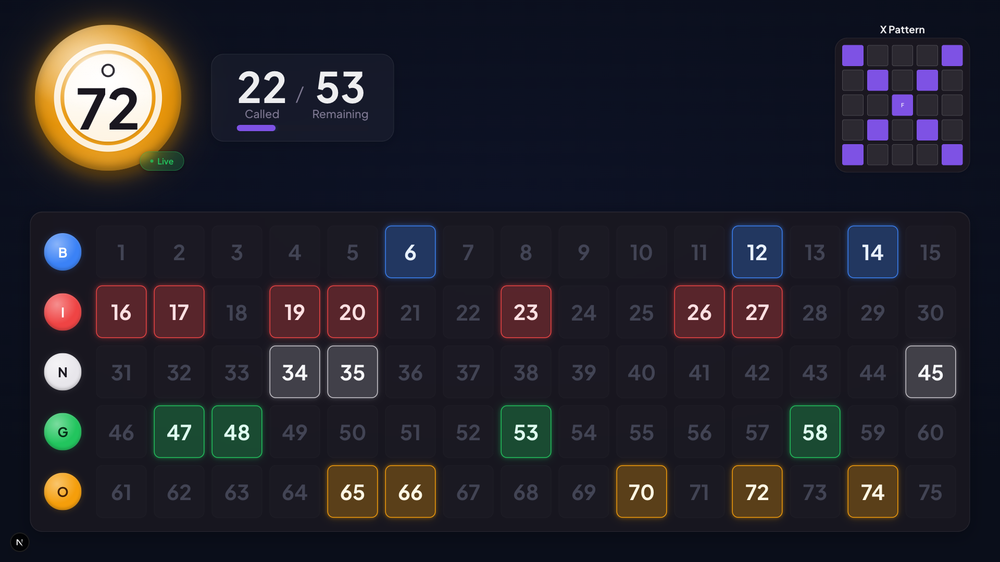
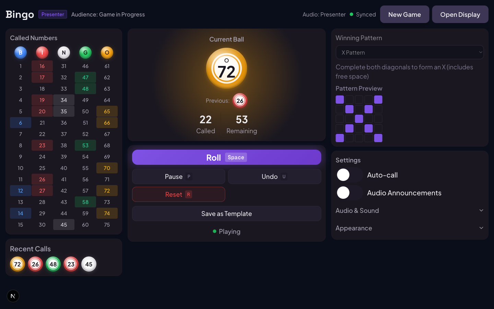
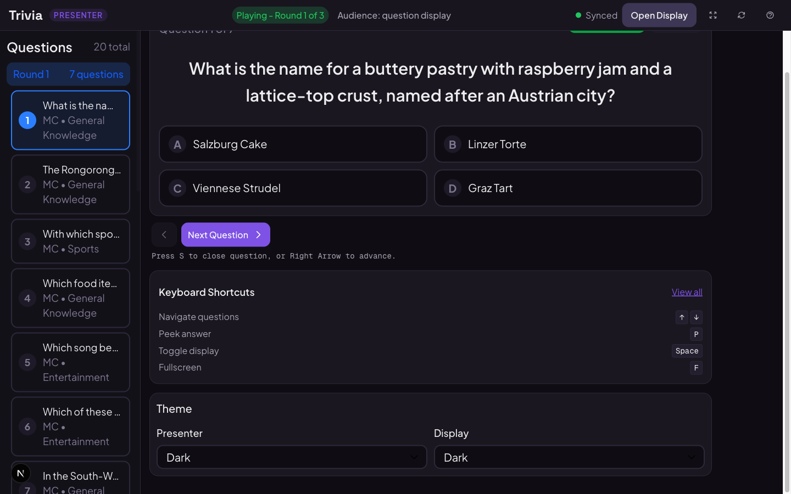
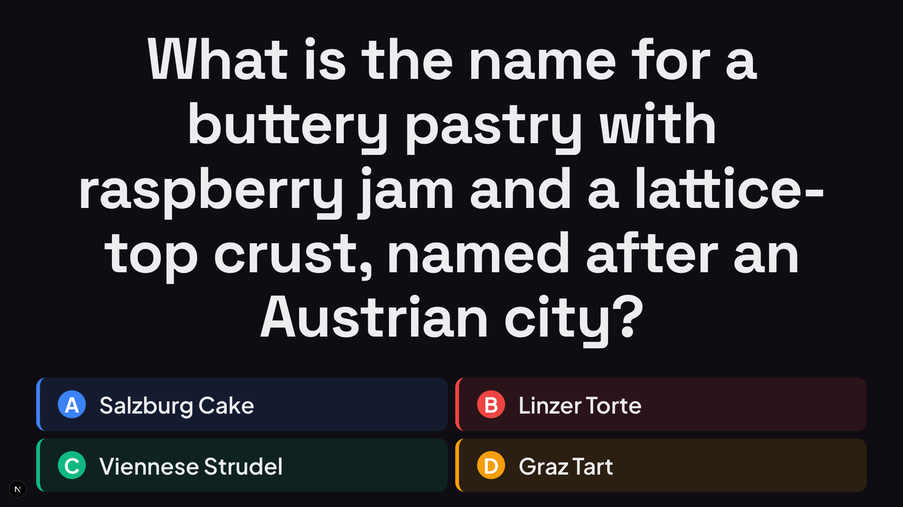

# Joolie Boolie

A dual-screen gaming platform for groups and communities. Run trivia nights and bingo games from any browser — one window for the host, another for the projector.

**[Play Bingo](https://bingo.joolie-boolie.com)** · **[Play Trivia](https://trivia.joolie-boolie.com)**

<p align="center">
  
</p>

---

## What This Is

Two standalone game apps (Bingo and Trivia) built as a Turborepo monorepo with 8 shared packages. No accounts, no server, no database — everything runs in the browser with localStorage persistence. Open `/play` to host, open `/display` on the projector, and go.

### Why It's Built This Way

- **Dual-screen sync** — Presenter and audience windows communicate via [BroadcastChannel API](https://developer.mozilla.org/en-US/docs/Web/API/Broadcast_Channel_API) with state hash verification, message deduplication, and latency monitoring. No WebSocket server needed.
- **Pure function game engines** — Game state flows through pure functions (`GameState in → engine function → GameState out`), wrapped by Zustand stores for React integration. Deep freeze in development catches accidental mutations.
- **Accessibility as architecture** — 168 design tokens enforce WCAG compliance at the token level: 44px minimum touch targets, 18px minimum body text, contrast ratios calculated per color. Not bolted on — it's the foundation.
- **Zero-config setup** — Clone, install, run. No environment variables, no database, no API keys required for local development.

---

## Getting Started

```bash
git clone https://github.com/julianken/joolie-boolie.git
cd joolie-boolie
pnpm install
pnpm dev
```

Open [localhost:3000/play](http://localhost:3000/play) (Bingo) or [localhost:3001/play](http://localhost:3001/play) (Trivia) in one tab, and the `/display` URL in another.

---

## Architecture

```
joolie-boolie/
├── apps/
│   ├── bingo/              Next.js 16 — 75-ball bingo with audio, 29 patterns
│   └── trivia/             Next.js 16 — Team trivia with rounds, scoring, TTS
└── packages/
    ├── sync/               BroadcastChannel dual-screen synchronization
    ├── ui/                 Shared components (Button, Modal, Toast, Slider, etc.)
    ├── theme/              168 design tokens, 10+ color themes, WCAG compliance
    ├── game-stats/         Statistics types, calculators, localStorage persistence
    ├── types/              Shared TypeScript definitions
    ├── audio/              Voice pack and sound effect utilities
    ├── error-tracking/     Sentry + OpenTelemetry integration
    └── testing/            BroadcastChannel and Web Audio API mocks
```

### Game Engine Pattern

```
GameState (immutable) → pure engine functions → new GameState
                              ↓
                      Zustand store (reactive)
                              ↓
                      React components via selectors
```

Both games use this pattern. The trivia engine adds a **16-scene audience display layer** (waiting → intro → question → reveal → scoring → podium) that runs orthogonally to the 4-state game status — you can change what the audience sees without changing game state.

### Dual-Screen Sync

The [`@joolie-boolie/sync`](./packages/sync/) package wraps BroadcastChannel with:

- **State hash divergence detection** — DJB2 hash on every state update catches silent desync
- **Message deduplication** — 100ms window prevents echo loops between windows
- **Latency monitoring** — Warns if sync exceeds 1000ms
- **Connection lifecycle** — Graceful init, reconnect, and teardown

No server involved. Works offline. Sub-10ms latency on the same device.

---

## Features

### Bingo

<table>
  <tr>
    <td width="50%"></td>
    <td width="50%"></td>
  </tr>
  <tr>
    <td align="center"><sub><b>Presenter</b> — host controls on a laptop</sub></td>
    <td align="center"><sub><b>Audience</b> — projector-optimized board</sub></td>
  </tr>
</table>

75-ball bingo (B-I-N-G-O columns), 29 patterns from simple lines to letters and blackout. Voice packs with British slang variant, configurable roll sounds (metal cage, tumbler, lottery), auto-call mode at adjustable speed. Full keyboard control.

### Trivia

<table>
  <tr>
    <td width="50%"></td>
    <td width="50%"></td>
  </tr>
  <tr>
    <td align="center"><sub><b>Presenter</b> — question sidebar and scene controls</sub></td>
    <td align="center"><sub><b>Audience</b> — dramatic question scene</sub></td>
  </tr>
</table>

Multi-round team trivia with configurable rounds and questions per round. Up to 20 teams with live scoring. Text-to-speech for questions and answers. Three ways to add questions: fetch from an external trivia API, upload a JSON file, or create manually. Built-in ChatGPT prompt guide for generating question sets. 16-scene audience display with timed transitions and emergency blank.

### Both Apps
- Light/dark/system themes with 10+ color options
- PWA with offline support (Serwist service worker)
- Fullscreen audience display optimized for projectors
- Keyboard shortcuts for presenter control
- localStorage persistence for templates, presets, settings, and statistics

---

## Tech Stack

| Layer | Technology |
|-------|------------|
| Monorepo | Turborepo + pnpm 9 |
| Framework | Next.js 16 (App Router) |
| UI | React 19 + Tailwind CSS 4 |
| State | Zustand 5 with localStorage persistence |
| Accessibility | React Aria Components + custom design tokens |
| Testing | Vitest 4 + Testing Library + Playwright |
| PWA | Serwist (Turbopack-native service worker) |
| Deployment | Vercel |

---

## Documentation

Each app and package has its own README with detailed documentation:

- [Bingo README](./apps/bingo/README.md) — Game mechanics, keyboard shortcuts, patterns
- [Trivia README](./apps/trivia/README.md) — Scene engine, scoring, question import
- [Sync Package](./packages/sync/README.md) — BroadcastChannel API and dual-screen protocol
- [Theme Package](./packages/theme/README.md) — Design tokens and WCAG compliance
- [UI Package](./packages/ui/README.md) — Shared component library

---

## Development

```bash
pnpm dev              # Run both apps
pnpm dev:bingo        # Bingo only (port 3000)
pnpm dev:trivia       # Trivia only (port 3001)
pnpm build            # Build everything
pnpm test:run         # Unit + integration tests
pnpm test:e2e         # Playwright E2E tests
pnpm lint             # ESLint
pnpm typecheck        # TypeScript strict mode
```

---

## License

MIT
