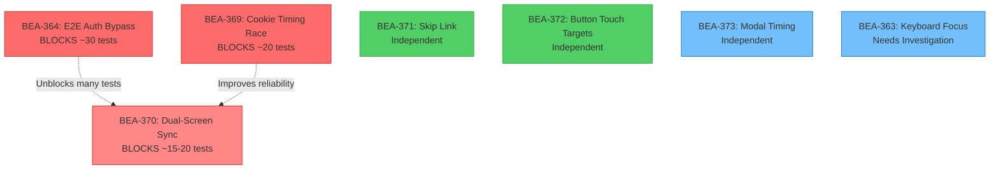

# E2E Test Failure Parallelization Plan

**Date:** 2026-01-26
**Status:** Ready for Execution
**Project:** E2E Testing Coverage (Linear)

## Executive Summary

After BEA-360 (Strict Mode Selector Violations), we have **74 failures** remaining. Investigation by 3 Opus agents revealed that most failures (66/74) are caused by test infrastructure issues, not actual bugs. Only 8 failures represent genuine application issues.

**Key Finding:** E2E tests are calling real Supabase auth API, sending actual emails, and hitting rate limits. This is the root cause of ~50 failures.

## Ticket Overview

| Ticket | Title | Impact | Complexity | Priority |
|--------|-------|--------|------------|----------|
| BEA-364 | E2E auth bypass (no Supabase calls) | ~25-30 failures | Medium | Urgent |
| BEA-369 | OAuth cookie timing race | ~20 failures | Simple | Urgent |
| BEA-370 | Dual-screen sync race condition | ~15-20 failures | Complex | Urgent |
| BEA-371 | Add skip link (WCAG 2.4.1) | 2 failures | Simple | High |
| BEA-372 | Button touch targets (WCAG 2.5.5) | 2 failures | Simple | High |
| BEA-373 | Session recovery modal timing | ~5-8 failures | Medium | Medium |
| BEA-363 | Keyboard focus on BODY | 2 failures | Medium | High |

**Total Test Failures Addressable:** ~66-74 out of 74

## Dependency Analysis



### Dependency Details

**Critical Path (Urgent - Must Fix First):**
1. **BEA-364** (E2E auth bypass) - BLOCKS ~30 tests
   - All other auth-related failures depend on this being fixed
   - Should be implemented FIRST
   - No dependencies

2. **BEA-369** (Cookie timing race) - BLOCKS ~20 tests
   - Independent of BEA-364 (different issue)
   - Can be done in parallel with BEA-364
   - Improves test reliability even if BEA-364 is mocked

3. **BEA-370** (Dual-screen sync) - BLOCKS ~15-20 tests, breaks core feature
   - Independent of auth issues
   - Can be done in parallel with BEA-364/369
   - More complex, but high impact

**Independent Work (High Priority - Can Parallelize):**
- **BEA-371** (Skip links) - Simple CSS/HTML change, WCAG Level A violation
- **BEA-372** (Button touch targets) - Simple CSS change, design requirement
- **BEA-363** (Keyboard focus) - Needs investigation first, then simple fix

**Lower Priority (Medium):**
- **BEA-373** (Modal timing) - UX polish, not blocking critical functionality

## Parallelization Strategy

### Phase 1: Unblock Tests (Week 1)

**Goal:** Eliminate test infrastructure failures, get to true application bugs

**Wave 1A - Auth Infrastructure (Parallel):**
```
Agent 1 (Opus): BEA-364 - E2E auth bypass
├─ Implement test auth bypass in Platform Hub
├─ Generate JWT tokens locally
└─ No Supabase calls during tests

Agent 2 (Opus): BEA-369 - Cookie timing race
├─ Add polling wait for cookie in auth fixture
├─ Exponential backoff retry logic
└─ 5-second timeout with intervals
```

**Expected Impact:** ~45-50 test failures resolved (30 from BEA-364, 20 from BEA-369)

**Wave 1B - Core Feature (Parallel):**
```
Agent 3 (Opus): BEA-370 - Dual-screen sync
├─ Investigate BroadcastChannel initialization timing
├─ Implement retry logic in display window
├─ Add acknowledgment protocol
└─ Test both Bingo and Trivia
```

**Expected Impact:** ~15-20 test failures resolved

### Phase 2: Accessibility Compliance (Week 1-2)

**Goal:** Fix WCAG violations and senior-friendly design requirements

**Wave 2A - Simple Fixes (Parallel):**
```
Agent 1 (Sonnet): BEA-371 - Skip links
├─ Add skip link to Bingo presenter page
├─ Add skip link to Trivia presenter page
└─ Update E2E tests

Agent 2 (Sonnet): BEA-372 - Button touch targets
├─ Add min-w-[44px] to Button component
├─ Review RollSoundSelector button usage
└─ Update E2E test to exclude Next.js dev tools button

Agent 3 (Sonnet): BEA-363 - Keyboard focus investigation
├─ Investigate why focus lands on BODY
├─ Check tabIndex attributes
├─ Fix focus management
└─ Verify across both apps
```

**Expected Impact:** ~6 test failures resolved

### Phase 3: UX Polish (Week 2)

**Goal:** Clean up UX issues

```
Agent 1 (Sonnet): BEA-373 - Modal timing
├─ Move offlineRecoveryAttempted flag
├─ Test recovery scenarios
└─ Verify modal behavior
```

**Expected Impact:** ~5-8 test failures resolved

## Work Allocation

### Option 1: Maximum Parallelization (3 Agents)

**Day 1-2:**
- Agent A (Opus): BEA-364 (E2E auth bypass)
- Agent B (Opus): BEA-369 (Cookie timing) + BEA-371 (Skip links)
- Agent C (Opus): BEA-370 (Dual-screen sync)

**Day 3-4:**
- Agent A (Sonnet): BEA-372 (Button touch targets)
- Agent B (Sonnet): BEA-363 (Keyboard focus)
- Agent C (Sonnet): BEA-373 (Modal timing)

**Total Time:** ~4 days with 3 parallel agents

### Option 2: Sequential with 2 Agents

**Week 1:**
- Agent A: BEA-364 → BEA-371 → BEA-372
- Agent B: BEA-369 → BEA-370

**Week 2:**
- Agent A: BEA-363 → BEA-373
- Agent B: (Available for new work)

**Total Time:** ~1.5 weeks with 2 agents

### Option 3: Recommended Hybrid (3 Agents, Prioritized)

**Phase 1 (Critical - Days 1-2):**
- **Agent A (Opus)**: BEA-364 (E2E auth bypass) ← HIGHEST PRIORITY
- **Agent B (Opus)**: BEA-369 (Cookie timing) ← HIGH PRIORITY
- **Agent C (Opus)**: BEA-370 (Dual-screen sync) ← HIGH PRIORITY

**Checkpoint:** Run full E2E suite, expect ~10-15 failures remaining

**Phase 2 (Accessibility - Days 3-4):**
- **Agent A (Sonnet)**: BEA-371 (Skip links) + BEA-372 (Touch targets)
- **Agent B (Sonnet)**: BEA-363 (Keyboard focus investigation + fix)
- **Agent C (Sonnet)**: BEA-373 (Modal timing)

**Final Checkpoint:** Run full E2E suite, expect 0-2 failures remaining

## Success Criteria

### Phase 1 Success
- [ ] BEA-364 merged: NO Supabase auth calls during E2E tests
- [ ] BEA-369 merged: Cookie timing race eliminated
- [ ] BEA-370 merged: Dual-screen sync works reliably
- [ ] Test failures reduced from 74 → <15

### Phase 2 Success
- [ ] BEA-371 merged: Skip links on all presenter pages (WCAG 2.4.1 ✓)
- [ ] BEA-372 merged: All buttons ≥44x44px (WCAG 2.5.5 ✓)
- [ ] BEA-363 merged: Keyboard navigation works correctly
- [ ] Test failures reduced from <15 → <5

### Phase 3 Success
- [ ] BEA-373 merged: No modal flash during recovery
- [ ] Test failures reduced from <5 → 0-2
- [ ] All WCAG Level A violations fixed
- [ ] E2E suite runs reliably without flakiness

## Risk Mitigation

### High-Risk Items

**BEA-364 (E2E Auth Bypass):**
- **Risk:** Breaking production auth flow
- **Mitigation:** Use environment flag `E2E_TESTING=true`, only affects test environment
- **Validation:** Verify production auth still works with flag disabled

**BEA-370 (Dual-Screen Sync):**
- **Risk:** Complex race condition, may have multiple root causes
- **Mitigation:** Start with simple retry logic, iterate if needed
- **Validation:** Run dual-screen tests in loop 10x to verify reliability

### Medium-Risk Items

**BEA-363 (Keyboard Focus):**
- **Risk:** Unknown root cause, may require component refactor
- **Mitigation:** Investigation phase first, then scoped fix
- **Validation:** Manual keyboard testing + E2E tests

## Test Validation Strategy

After each phase:

1. **Run full E2E suite:**
   ```bash
   pnpm test:e2e
   pnpm test:e2e:summary
   ```

2. **Verify failure count reduction:**
   - Phase 1: Expect 74 → ~10-15 failures
   - Phase 2: Expect ~10-15 → ~5 failures
   - Phase 3: Expect ~5 → 0-2 failures

3. **Check for regressions:**
   - Previously passing tests should still pass
   - No new failures introduced

4. **Validate in isolation:**
   - Run affected test files individually
   - Verify they pass consistently (5+ runs)

## Linear Workflow

All tickets are in **E2E Testing Coverage** project in Linear.

**Process for each ticket:**
1. Move to "In Progress" when starting work
2. Create worktree: `BEA-###-description`
3. Implement fix
4. Run affected E2E tests locally
5. Create PR with "Fixes BEA-###" in description
6. Run full E2E suite before merging
7. Merge to main
8. Move Linear ticket to "Done"
9. Update this plan with actual results

## Appendix: Agent Investigation Reports

Full investigation reports from 3 Opus agents available in Linear tickets:
- **Agent 1**: Auth & Rate Limit Failures (BEA-364, BEA-369)
- **Agent 2**: Accessibility Failures (BEA-371, BEA-372, BEA-363)
- **Agent 3**: Session & Sync Failures (BEA-370, BEA-373)

Each report includes:
- Root cause analysis
- Affected test files
- Proposed solutions
- Complexity estimates
- WCAG criterion references (where applicable)
